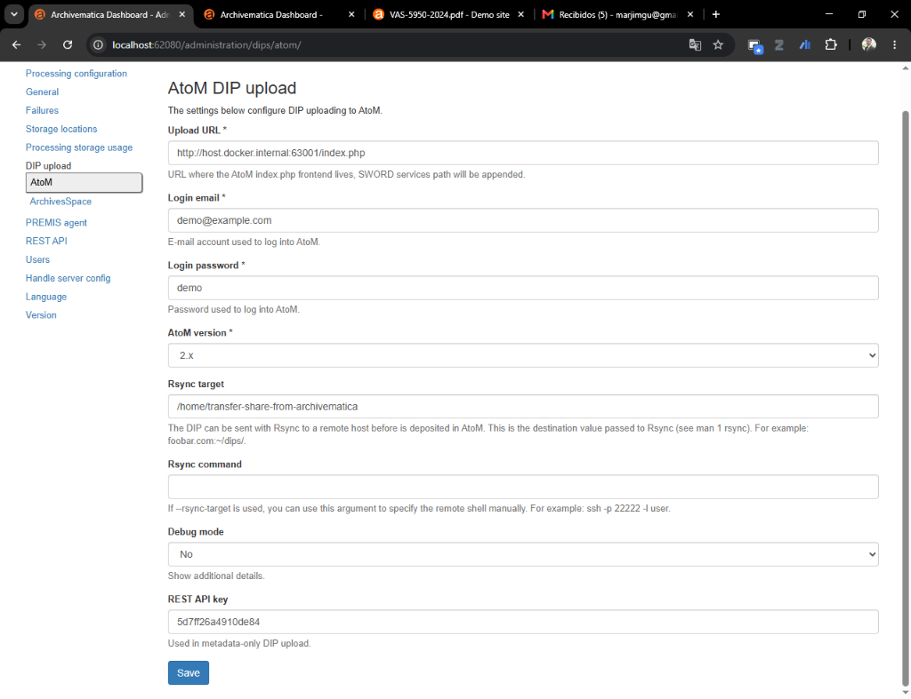
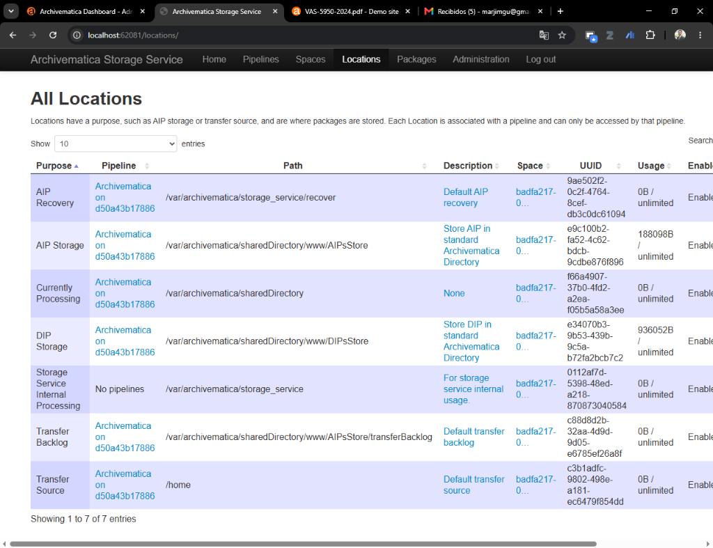
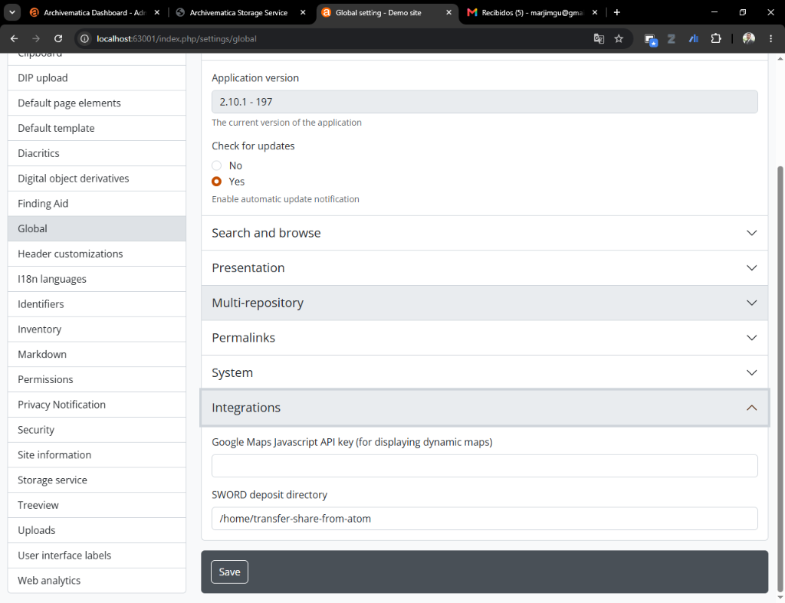

# Especificación Técnica: Integración de Archivematica y AtoM en WSL2/Docker

**Autor**: Marco Antonio Jiménez Gutiérrez  
**Contacto**: marco.jimenezgutierrez@ucr.ac.cr  
**Contexto**: Desarrollado para la Universidad de Costa Rica (UCR) — Archivo Universitario Rafael Obregón Loría (AUROL).

Este documento describe la arquitectura y las configuraciones necesarias para integrar Archivematica (1.x) y AtoM (2.x) ejecutándose en el mismo host Docker/WSL2, con énfasis en habilitar la carga de DIPs desde Archivematica hacia AtoM, incluyendo la generación de miniaturas.

Para los pasos de instalación, consulte el [Runbook](Runbook_Instalacion_Archivematica_y_AtoM_en_Docker_v1.0.docx).

---

## Referencia rápida

### URLs y credenciales de los servicios

| Servicio | URL | Usuario | Contraseña |
|:---|:---|:---|:---|
| Archivematica Dashboard | http://localhost:62080 | `test` | `test` |
| Archivematica Storage Service | http://localhost:62081 | `test` | `test` |
| AtoM | http://localhost:63001 | `demo@example.com` | `demo` |

> Estas son las credenciales por defecto del entorno hack/dev. Cámbielas antes de cualquier uso en producción.

### Acceso SFTP (para que archivistas suban transferencias)

Los archivistas depositan paquetes de transferencia mediante SFTP usando cualquier cliente estándar (WinSCP, FileZilla o el CLI `sftp`).

| Campo | Valor |
|:---|:---|
| Protocolo | SFTP |
| Host | IP del host Windows (o `localhost` si se conecta desde la misma máquina) |
| Puerto | `6222` |
| Usuario | `archivista` |
| Contraseña | `Archivista2026` |
| Carpeta remota | `/home/archivista/transfer-source-sigedi` |

Los archivos depositados en esa carpeta remota aparecen de inmediato como fuente de transferencia en Archivematica.

---

## 1. Resumen de la arquitectura

Ambos sistemas se ejecutan en contenedores Docker aislados y no comparten un sistema de archivos de forma predeterminada. La integración utiliza dos **bind mounts al host** que conectan los sistemas sin requerir transferencias de red entre contenedores.

```
[Archivista]
    │
    │  SFTP (puerto 6222)
    ▼
[transfer-source]  ←── Windows: C:\ArchivematicaDrop\transfer-source
    │                   WSL:     /mnt/c/ArchivematicaDrop/transfer-source
    │                   Contenedor: /home/transfer-source-sigedi
    │  Transferencia estándar
    ▼
[Archivematica]  ──→  SIP / AIP (preservado)
    │
    │  Carga de DIP (SWORD vía qtSwordPlugin)
    ▼
[transfer-share]   ←── Windows: C:\ArchivematicaDrop\transfer-share
    │                   WSL:     /mnt/c/ArchivematicaDrop/transfer-share
    │                   Contenedor Archivematica: /home/transfer-share-from-archivematica
    │                   Contenedor AtoM:          /home/transfer-share-from-atom
    │
    ▼
[AtoM]  ──→  Registro descriptivo + objeto digital + miniaturas (publicado)
```

### Los dos directorios compartidos

| Directorio | Ruta en el host | Función |
|:---|:---|:---|
| `transfer-source` | `C:\ArchivematicaDrop\transfer-source` | Los archivistas depositan paquetes de transferencia aquí; Archivematica los lee como fuente de transferencia |
| `transfer-share` | `C:\ArchivematicaDrop\transfer-share` | Archivematica escribe los DIPs aquí; AtoM los lee desde su propio montaje del contenedor |

Los scripts de instalación inyectan ambas rutas en `docker-compose.override.yml` automáticamente.

---

## 2. Configuración de la integración

Aunque la infraestructura es automatizada por los scripts de instalación, las siguientes configuraciones deben aplicarse manualmente en las interfaces web para completar la integración.

### A. Archivematica Dashboard — Carga de DIP a AtoM

Navegue a **Administration → AtoM DIP upload** en el Dashboard de Archivematica (http://localhost:62080).



| Configuración | Valor | Notas |
|:---|:---|:---|
| Upload URL | `http://host.docker.internal:63001/index.php` | Enruta desde el contenedor de Archivematica a través del host hasta el puerto de AtoM. Usar `localhost` aquí resolvería dentro del contenedor y fallaría. |
| Login email | `demo@example.com` | Cuenta de administrador de AtoM |
| Login password | `demo` | Contraseña del administrador de AtoM |
| AtoM version | `2.x` | |
| Rsync target | `/home/transfer-share-from-archivematica` | Ruta *dentro del contenedor de Archivematica* donde se deposita el DIP |
| REST API key | *(ver más abajo)* | Requerida para autorización y mapeo de metadatos |

**Cómo obtener la REST API key de AtoM:** En AtoM, vaya a **Admin → Usuarios**, edite el usuario administrador y copie el valor del campo **REST API key**. Si está vacío, haga clic en **Generar** para crear una.

### B. Archivematica Storage Service — Verificar ubicaciones del pipeline

Navegue a **Locations** en el Storage Service (http://localhost:62081/locations/) y confirme que las ubicaciones de fuente de transferencia y almacenamiento de AIP del pipeline estén activas y apunten a las rutas esperadas.



### C. AtoM — Configuración global (directorio de depósito SWORD)

Navegue a **Admin → Configuración → Global** en AtoM (http://localhost:63001).



| Configuración | Valor | Notas |
|:---|:---|:---|
| SWORD deposit directory | `/home/transfer-share-from-atom` | Ruta *dentro del contenedor de AtoM* donde buscará los DIPs entrantes |

> **Si el campo no aparece en la interfaz:** La configuración puede definirse directamente en `apps/qubit/config/app.yml` como `sword_deposit_dir: /home/transfer-share-from-atom`. Tras editar el archivo, limpie el caché de Symfony (`php symfony cc`) y reinicie `atom_worker`.

---

## 3. Flujo de trabajo completo

Use esta secuencia para validar la integración de principio a fin.

1. **Depositar una transferencia** — Copie una carpeta con PDFs o imágenes a la fuente de transferencia:
   - Vía SFTP: conéctese con las credenciales indicadas arriba y suba los archivos a `/home/archivista/transfer-source-sigedi`
   - Directamente en el host: copie a `C:\ArchivematicaDrop\transfer-source`

2. **Iniciar una transferencia en Archivematica** — Dashboard → pestaña **Transfer** → Standard transfer → Browse → seleccione la carpeta → Start transfer.

3. **Procesar el pipeline** — Apruebe cada paso del micro-servicio hasta que aparezca **Upload DIP**. Seleccione el destino AtoM configurado.

4. **Monitorear los logs** — Si la carga falla o se detiene, observe los logs de los contenedores en paralelo:

   ```bash
   # MCP Client de Archivematica (envía el DIP)
   cd ~/src/archivematica/hack
   docker compose logs -f archivematica-mcp-client

   # Worker de AtoM (recibe el DIP, genera miniaturas)
   cd ~/src/atom
   export COMPOSE_FILE="docker/docker-compose.dev.yml:docker/docker-compose.override.yml"
   docker compose logs -f atom_worker
   ```

5. **Verificar en AtoM** — Navegue a http://localhost:63001. El registro descriptivo debe estar presente y el visor de objetos digitales debe mostrar los archivos cargados con las miniaturas generadas.

---

## 4. Configuración remota: SSH/Rsync

La arquitectura de bind mount compartido funciona únicamente cuando ambos sistemas se ejecutan en el mismo host físico. Para despliegues distribuidos (Archivematica y AtoM en servidores separados), el DIP debe transferirse por la red mediante Rsync/SSH.

### Archivematica (remitente)

1. Genere un par de claves SSH para el usuario del contenedor `archivematica-mcp-client`.
2. Configure **Rsync target** con una ruta SSH remota: `usuario@servidor-atom.ejemplo.com:/ruta/al/deposito/`
3. Si usa un puerto no estándar o clave personalizada: configure **Rsync command** como `ssh -i /home/archivematica/.ssh/id_rsa -p 2222`

### AtoM (receptor)

1. Asegúrese de que `sshd` esté en ejecución y accesible desde la IP del servidor de Archivematica.
2. Agregue la clave pública de Archivematica al archivo `~/.ssh/authorized_keys` del usuario receptor.
3. El usuario receptor debe tener permisos de escritura sobre el directorio de depósito SWORD. Si el usuario SSH es diferente al usuario PHP-FPM (`www-data`), use un grupo compartido con `chmod g+s` y permisos `775` para que el worker de AtoM pueda procesar los archivos.
